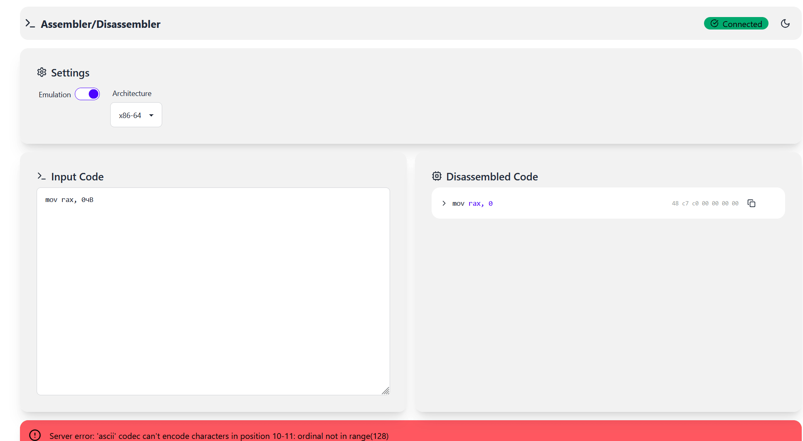

# Web-based Disassembler/Assembler and Emulator

[](images/preview.gif)

This project provides a web-based application for disassembling, assembling, and *emulating* code. Built using React (frontend), Python (backend), and Unicorn Engine for emulation, 

## Features

* **Disassembly:** Converts machine code (hex bytes) into human-readable assembly language. Supports x86_64, ARM, and MIPS architectures.
* **Assembly:** Converts assembly language into machine code (hex bytes). Supports x86_64, ARM, and MIPS.
* **Emulation (powered by Unicorn Engine):**  Executes code step-by-step and inspects register values after each instruction. Supports x86_64 (including floating-point and SSE registers), ARM, and MIPS.
* **Automatic Input Type Detection:**  Intelligently identifies assembly, hexadecimal, or shellcode input formats. No manual selection required.
* **Interactive Interface:** User-friendly web interface built with React for easy code manipulation and navigation.
* **Register Visualization:** Real-time display of register values during emulation, specific to the selected architecture.
* **Architecture Selection:**  Easily switch between x86_64, ARM, and MIPS architectures.
* **Emulation Control:** Enable/disable emulation as needed.
* **Cross-Platform Compatibility:**  Works in any modern web browser, independent of the operating system.


## Installation

1. **Clone the repository:**

```bash
git clone https://github.com/your-username/your-repository-name.git
```

2. **Backend Setup (Python):**

Navigate to the project's root directory and install the required Python dependencies, including Unicorn Engine:

```bash
pip install -r requirements.txt
```

For [Python ver >= 3.12.x](https://stackoverflow.com/a/77360702) need to additionaly install `setuptools`:
```bash
pip install setuptools
```

3. **Frontend Setup (React):**

Navigate to the `frontend` directory and install the necessary Node.js packages:

```bash
cd frontend
npm install
```

4. **Running the Application:**

* **Backend:** Start the Python backend server (replace with your specific command):

```bash
python server.py
```

* **Frontend:** Start the React development server:

```bash
npm start
```

The application should now be accessible in your browser (usually `http://localhost:3000`).


## Usage

1. **Input:** Provide machine code or assembly code.
5. **Output:** View the results in the designated output areas.


## Contributing

Contributions are welcome!
